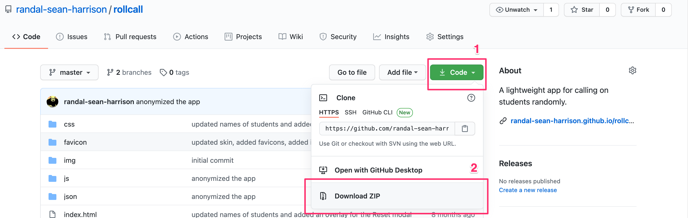

<!DOCTYPE html>
<html lang="en">

<head>
  <meta charset="utf-8">
  <meta http-equiv="X-UA-Compatible" content="IE=edge">
  <meta name="viewport" content="width=device-width, initial-scale=1">
  <title>Title</title>
  <link rel="stylesheet" href="https://maxcdn.bootstrapcdn.com/bootstrap/3.3.7/css/bootstrap.min.css" integrity="sha384-BVYiiSIFeK1dGmJRAkycuHAHRg32OmUcww7on3RYdg4Va+PmSTsz/K68vbdEjh4u" crossorigin="anonymous">
  <link href="https://fonts.googleapis.com/css?family=Open+Sans:300,400,400i,600,700" rel="stylesheet">
  <link rel="stylesheet" href="https://maxcdn.bootstrapcdn.com/font-awesome/4.7.0/css/font-awesome.min.css">

  
</head>

<body>
  

    <h1>Roll Call App</h1>
    
Roll Call is a fun little proof-of-concept app useful for calling on students randomly. Pedagogically, this works best when there are a large number of students in a class. The future features roadmap includes 1) pulling some Shakespearean, and perhaps pirate-themed name calling from an API, and 2) building a function to load student rosters directly from CSV files.

    

    <h3>Instructions</h3>
    <ol>
    <li class="push-down-1">Download the app to your computer by clicking  <strong>Code > Download ZIP</strong>. 
    

    </li>
    <li class="push-down-1">Open the <code>students.json</code> file in the <code>/json</code> folder and replace the sample student names (currently Star Wars characters) with the names of your own students.</li>
    <li>Open the index file in any browser.</li>
    </ol>

    <h3 class="push-down-3">Example students.json file</h3>
<pre class='prettyprint linenums lang-js'>
[
  "John Adams",
  "Ofore Amankona",
  "Maria Espinosa",
  "Ryu Tanaka"
]
</pre>

<strong>NOTE</strong> Make sure to leave the trailing comma off the last entry in the students.json file. In the example above, separate all entries with trailing commas EXCEPT "Ryu Tanaka".

  

  
  
</body>

</html>
